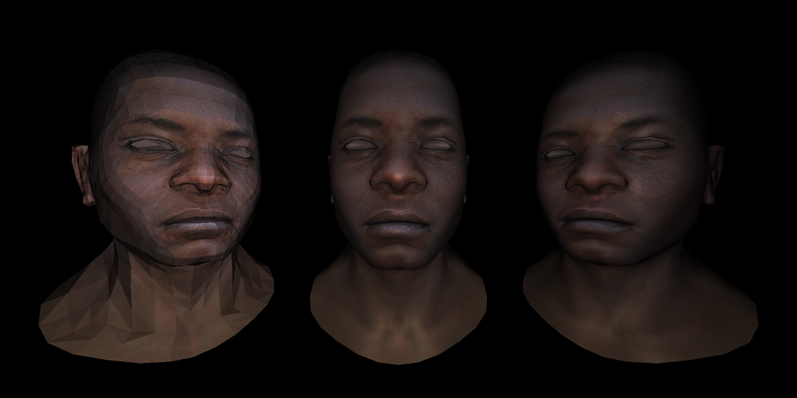
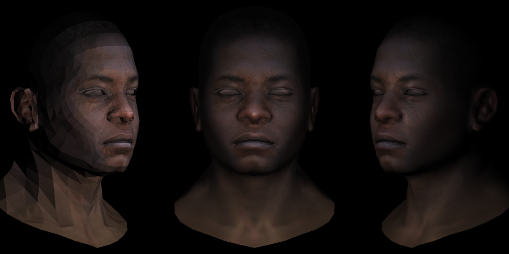
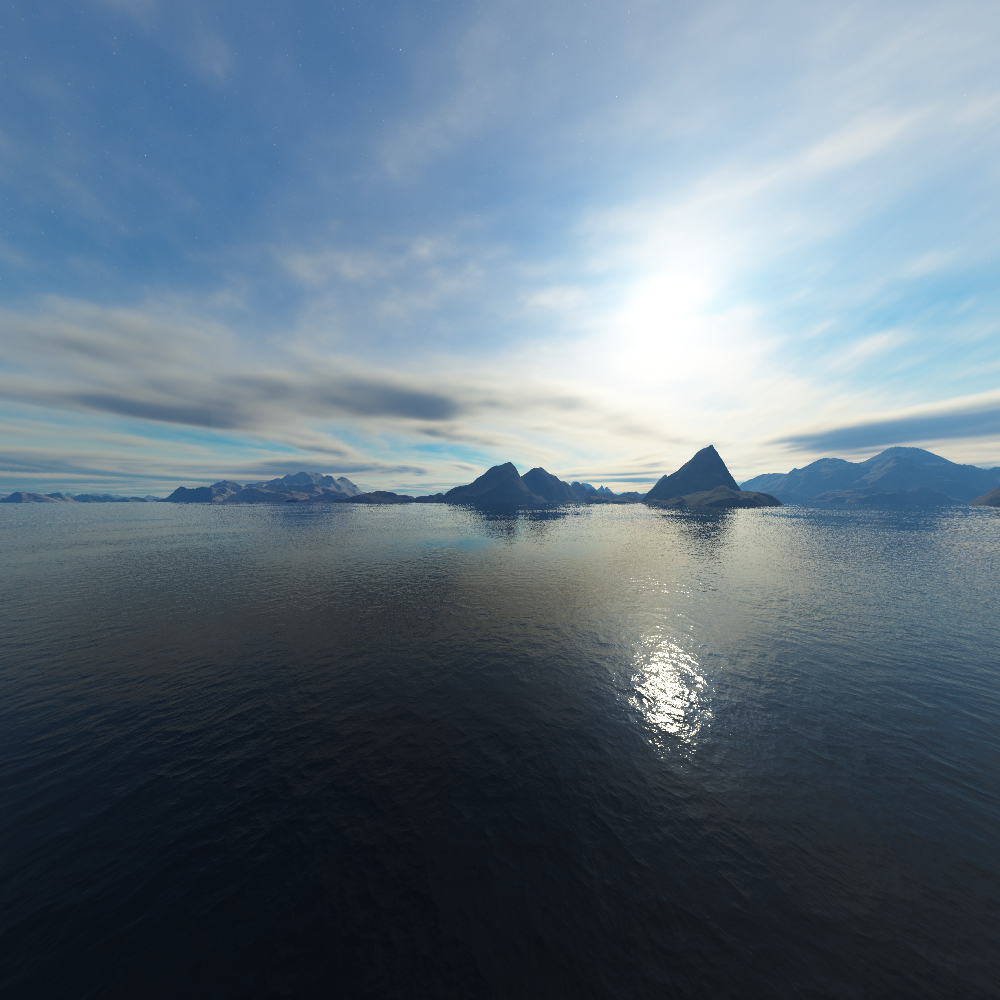
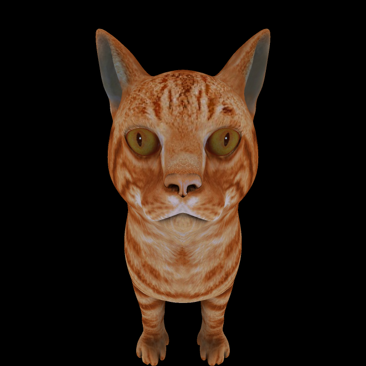
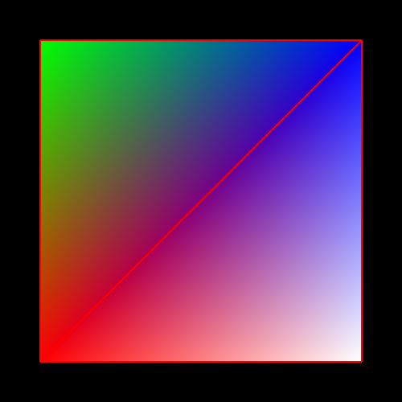
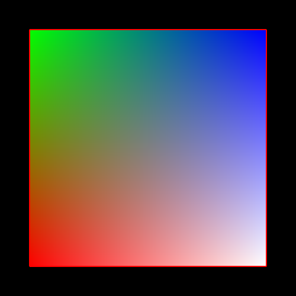

# Tiny Rasterizer

A tiny rasterizer I am working on.

How it works. You specify the scene to render in a file. That scene will contain
models (meshes), lights, and meta data (supersampling, save location). The scene will
be rendered to TGA file.

**Current Features**
- Skybox rendering
- Triangle rasterization
- Quad rasterization
- Line rasterization
- Flat (per-privative) shading
- Gouraud (per-vertex) shading
- Phong (per-pixel) shading
- Specify scene to render from a file
- Supersampling
- Orthographic & perspective cameras
- Point & directional lights

## Some Rendered Images

Three heads each with different shading (flat, phong, gouraud). Taken with perspective camera.  

Three heads each with different shading (flat, phong, gouraud). Taken with orthographic camera. 

Skybox.  

Cat made from a quad mesh. No shading.  

A quad made from two rasterized triangles.  

A quad made from one rasterized quad.  

## Credit

I used Dmitry V. Sokolov's [tinyrenderer](https://github.com/ssloy/tinyrenderer) project as a guide for making this project. I did not follow 1-for-1 his project, instead used it as a guide. Although, I did make use of some of his code, like the TGA file import/save code, his vector class code, and the model loader code.